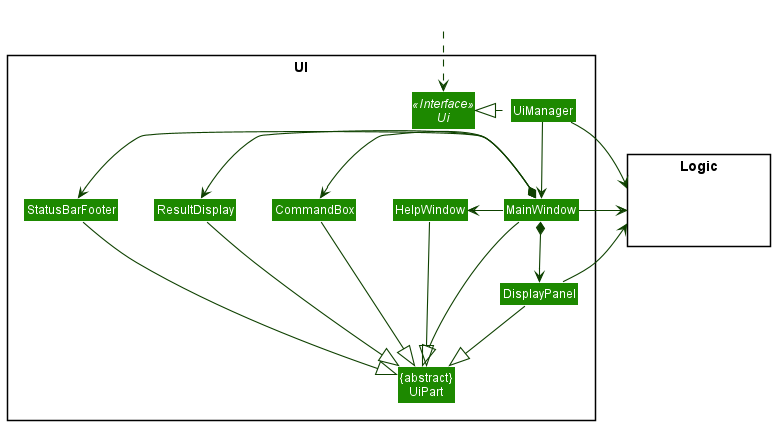
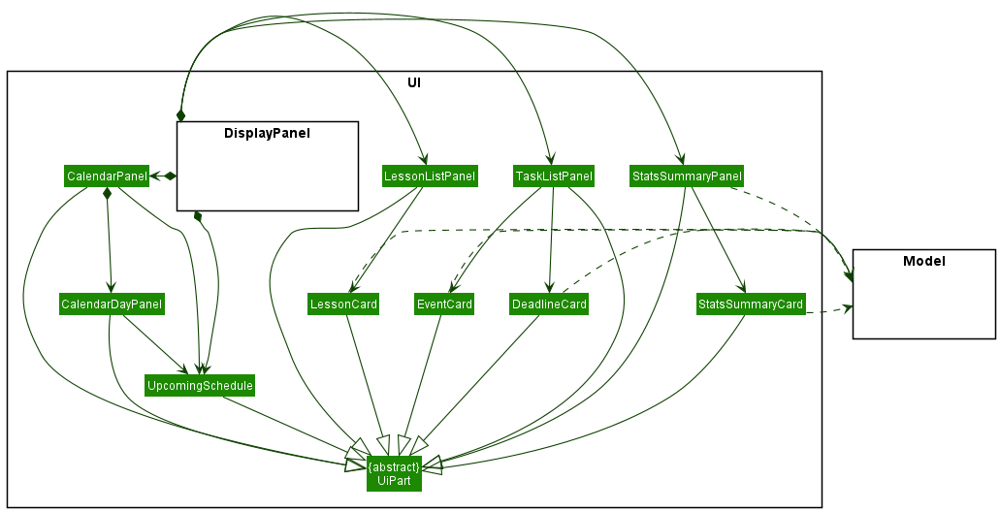
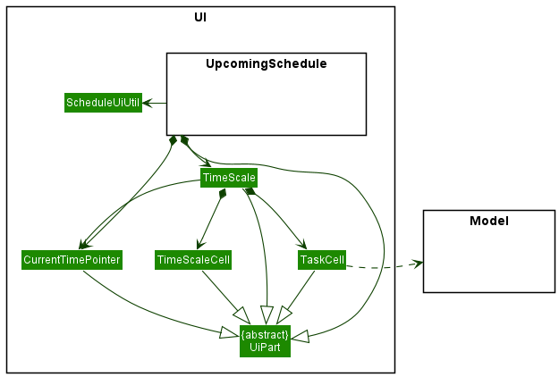
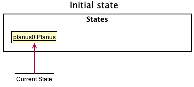
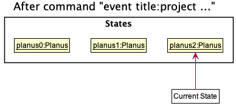
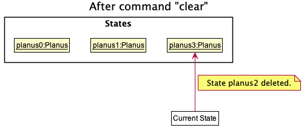

* Table of Contents
{:toc}

--------------------------------------------------------------------------------------------------------------------

## **Setting up, getting started**

For detailed instructions on how to set the application up, refer to the guide [_Setting up and getting started_](SettingUp.md).

--------------------------------------------------------------------------------------------------------------------

## **Design**
This section describes the implementation of the design of the app.

### Architecture

The ***Architecture Diagram*** given above explains the high-level design of the App. Given below is a quick overview of each component.

:bulb: **Tip:** The `.puml` files used to create diagrams in this document can be found in the [diagrams](https://github.com/se-edu/addressbook-level3/tree/master/docs/diagrams/) folder. Refer to the [_PlantUML Tutorial_ at se-edu/guides](https://se-education.org/guides/tutorials/plantUml.html) to learn how to create and edit diagrams.

**`Main`** has two classes called [`Main`](https://github.com/se-edu/addressbook-level3/tree/master/src/main/java/seedu/address/Main.java) and [`MainApp`](https://github.com/se-edu/addressbook-level3/tree/master/src/main/java/seedu/address/MainApp.java). It is responsible for,

* At app launch: Initializes the components in the correct sequence, and connects them up with each other.
* At shut down: Shuts down the components and invokes cleanup methods where necessary.

[**`Commons`**](#common-classes) represents a collection of classes used by multiple other components.

The rest of the App consists of four components.

* [**`UI`**](#ui-component): The UI of the App.
* [**`Logic`**](#logic-component): The command executor.
* [**`Model`**](#model-component): Holds the data of the App in memory.
* [**`Storage`**](#storage-component): Reads data from, and writes data to, the hard disk.

Each of the four components,

* defines its *API* in an `interface` with the same name as the Component.
* exposes its functionality using a concrete `{Component Name}Manager` class (which implements the corresponding API `interface` mentioned in the previous point.

For example, the `Logic` component (see the class diagram given below) defines its API in the `Logic.java` interface and exposes its functionality using the `LogicManager.java` class which implements the `Logic` interface.

**How the architecture components interact with each other**

The *Sequence Diagram* below shows how the components interact with each other for the scenario where the user issues the command `delete-task 1`.

The sections below give more details of each component.

### UI component

 
Structure of the UI Component MainWindow
 
Structure of the UI Component for DisplayPanel
 
Structure of the UI Component for UpcomingSchedule and below

**API** :
[`Ui.java`](https://github.com/se-edu/addressbook-level3/tree/master/src/main/java/seedu/address/ui/Ui.java)

The UI consists of a `MainWindow` that is made up of parts e.g.`CommandBox`, `ResultDisplay`, `TaskListPanel`, `StatusBarFooter` etc. All these, including the `MainWindow`, inherit from the abstract `UiPart` class.

The `UI` component uses JavaFx UI framework. The layout of these UI parts are defined in matching `.fxml` files that are in the `src/main/resources/view` folder. For example, the layout of the [`MainWindow`](https://github.com/se-edu/addressbook-level3/tree/master/src/main/java/seedu/address/ui/MainWindow.java) is specified in [`MainWindow.fxml`](https://github.com/se-edu/addressbook-level3/tree/master/src/main/resources/view/MainWindow.fxml)

The `UI` component,

* Executes user commands using the `Logic` component.
* Listens for changes to `Model` data so that the UI can be updated with the modified data.

### Logic component

**API** :
[`Logic.java`](https://github.com/se-edu/addressbook-level3/tree/master/src/main/java/seedu/address/logic/Logic.java)

1. `Logic` uses the `PlanusParser` class to parse the user command.
1. This results in a `Command` object which is executed by the `LogicManager`.
1. The command execution can affect the `Model` (e.g. adding a task).
1. The result of the command execution is encapsulated as a `CommandResult` object which is passed back to the `Ui`.
1. In addition, the `CommandResult` object can also instruct the `Ui` to perform certain actions, such as displaying help to the user.

Given below is the Sequence Diagram for interactions within the `Logic` component for the `execute("delete-task 1")` API call.

:information_source: **Note:** The lifeline for `DeleteTaskCommandParser` should end at the destroy marker (X) but due to a limitation of PlantUML, the lifeline reaches the end of diagram.

### Model component

**API** : [`Model.java`](https://github.com/se-edu/addressbook-level3/tree/master/src/main/java/seedu/address/model/Model.java)

The `Model`,

* stores a `UserPref` object that represents the user’s preferences.
* stores the PlaNus data.
* exposes an unmodifiable `ObservableList<Task>`, `ObservableList<Event>` and `ObservableList<Lesson>` that can be 'observed' e.g. the UI can be bound to these lists so that the UI automatically updates when the data in the list changes.
* does not depend on any of the other three components.

:information_source: **Note:** An alternative (arguably, a more OOP) model is given below. It has a `Tag` list in the `PlaNus`, which `Task` references. This allows `PlaNus` to only require one `Tag` object per unique `Tag`, instead of each `Task` needing their own `Tag` object. 

### Storage component

**API** : [`Storage.java`](https://github.com/se-edu/addressbook-level3/tree/master/src/main/java/seedu/address/storage/Storage.java)

The `Storage` component,

* can save `UserPref` objects in json format and read it back.
* can save the PlaNus data in json format and read it back.

### Common classes

Classes used by multiple components are in the `seedu.addressbook.commons` package.

--------------------------------------------------------------------------------------------------------------------

## **Implementation**

This section describes some noteworthy details on how certain features are implemented.

### \[Proposed\] Undo/redo feature

#### Proposed Implementation

The proposed undo/redo mechanism is facilitated by `VersionedAddressBook`. It extends `AddressBook` with an undo/redo history, stored internally as an `addressBookStateList` and `currentStatePointer`. Additionally, it implements the following operations:

* `VersionedAddressBook#commit()` — Saves the current address book state in its history.
* `VersionedAddressBook#undo()` — Restores the previous address book state from its history.
* `VersionedAddressBook#redo()` — Restores a previously undone address book state from its history.

These operations are exposed in the `Model` interface as `Model#commitAddressBook()`, `Model#undoAddressBook()` and `Model#redoAddressBook()` respectively.

Given below is an example usage scenario and how the undo/redo mechanism behaves at each step.

Step 1. The user launches the application for the first time. The `VersionedAddressBook` will be initialized with the initial address book state, and the `currentStatePointer` pointing to that single address book state.

Step 2. The user executes `delete 5` command to delete the 5th task in the address book. The `delete` command calls `Model#commitAddressBook()`, causing the modified state of the address book after the `delete 5` command executes to be saved in the `addressBookStateList`, and the `currentStatePointer` is shifted to the newly inserted address book state.

Step 3. The user executes `add n/David …` to add a new task. The `add` command also calls `Model#commitAddressBook()`, causing another modified address book state to be saved into the `addressBookStateList`.

:information_source: **Note:** If a command fails its execution, it will not call `Model#commitAddressBook()`, so the address book state will not be saved into the `addressBookStateList`.

Step 4. The user now decides that adding the task was a mistake, and decides to undo that action by executing the `undo` command. The `undo` command will call `Model#undoAddressBook()`, which will shift the `currentStatePointer` once to the left, pointing it to the previous address book state, and restores the address book to that state.

:information_source: **Note:** If the `currentStatePointer` is at index 0, pointing to the initial AddressBook state, then there are no previous AddressBook states to restore. The `undo` command uses `Model#canUndoAddressBook()` to check if this is the case. If so, it will return an error to the user rather
than attempting to perform the undo.

The following sequence diagram shows how the undo operation works:

:information_source: **Note:** The lifeline for `UndoCommand` should end at the destroy marker (X) but due to a limitation of PlantUML, the lifeline reaches the end of diagram.

The `redo` command does the opposite — it calls `Model#redoAddressBook()`, which shifts the `currentStatePointer` once to the right, pointing to the previously undone state, and restores the address book to that state.

:information_source: **Note:** If the `currentStatePointer` is at index `addressBookStateList.size() - 1`, pointing to the latest address book state, then there are no undone AddressBook states to restore. The `redo` command uses `Model#canRedoAddressBook()` to check if this is the case. If so, it will return an error to the user rather than attempting to perform the redo.

Step 5. The user then decides to execute the command `list`. Commands that do not modify the address book, such as `list`, will usually not call `Model#commitAddressBook()`, `Model#undoAddressBook()` or `Model#redoAddressBook()`. Thus, the `addressBookStateList` remains unchanged.

Step 6. The user executes `clear`, which calls `Model#commitAddressBook()`. Since the `currentStatePointer` is not pointing at the end of the `addressBookStateList`, all address book states after the `currentStatePointer` will be purged. Reason: It no longer makes sense to redo the `add n/David …` command. This is the behavior that most modern desktop applications follow.

The following activity diagram summarizes what happens when a user executes a new command:

#### Design consideration:

##### Aspect: How undo & redo executes

* **Alternative 1 (current choice):** Saves the entire address book.
  * Pros: Easy to implement.
  * Cons: May have performance issues in terms of memory usage.

* **Alternative 2:** Individual command knows how to undo/redo by
  itself.
  * Pros: Will use less memory (e.g. for `delete`, just save the task being deleted).
  * Cons: We must ensure that the implementation of each individual command are correct.

_{more aspects and alternatives to be added}_

### \[Proposed\] Data archiving

_{Explain here how the data archiving feature will be implemented}_

--------------------------------------------------------------------------------------------------------------------

## **Documentation, logging, testing, configuration, dev-ops**

* [Documentation guide](Documentation.md)
* [Testing guide](Testing.md)
* [Logging guide](Logging.md)
* [Configuration guide](Configuration.md)
* [DevOps guide](DevOps.md)

--------------------------------------------------------------------------------------------------------------------

## **Appendix: Requirements**

### Product scope

**Target user profile**:

* NUS Student
* has a lot of projects and modules
* can type fast
* wants to track productivity and workload

**Value proposition**: Allows NUS students to manage their tasks and visualise 
them on a calendar as well as time spent on tasks and lessons so as to improve their productivity.

### User stories

Priorities: High (must have) - `* * *`, Medium (nice to have) - `* *`, Low (unlikely to have) - `*`

| Priority | As a …                  | I want to …                                | So that I can…                      |
| -------- | ----------------------- | ------------------------------------------ | ----------------------------------- |
| `* * *`  | new user                | have a help command                        | easily access the user guide.       |
| `* * *`  | user                    | add new task to my list                    |                                     |
| `* * *`  | student                 | know when my tasks are due                 |                                     |
| `* * *`  | user                    | maintain a list of tasks I currently have  |                                     |
| `* * *`  | user with a lot of tasks| delete my task after it is not relevant   | focus on only the unfinished tasks.  |
| `* * *`  | user                    | mark my task as done after it is completed | track the status of the task.       |
| `* *  `  | user                    | find tasks by date                         | easily know what events or deadlines are on that date. |
| `* * *`  | user                    | find tasks by title                        |                                     |
| `* *  `  | user                    | find tasks by description                  |                                     |
| `* *  `  | user                    | find tasks by module it is associated      |                                     |
| `* *  `  | user                    | find completed and uncompleted deadlines   | have a quick glance of what are to be completed. |
| `* * *`  | user                    | edit my tasks                              |                                     |
| `* * *`  | user                    | maintain a list of lessons I currently have  | track  my lessons.                |
| `* * *`  | user with a lot of lessons| delete my lesson after it is not relevant   | focus on only the lessons I currently take. |
| `* *  `  | user                    | find lesson by module code                 | easily know what lessons are associated with a particular module |
| `* *  `  | user                    | find lesson by date                        | easily know what lessons I have on a particular date.            |
| `* *  `  | user                    | find lesson by time                        | easily know what lessons I have on a particular time.            |
| `* * *`  | user                    | find tasks by title                        |                                     |
| `* * *`  | user                    | edit my lessons                            |                                     |
| `* * *`  | user who is interested in tracking my productivity | have a visualisation of my workload in the past week | have a sense of how productive I was in the past week |
| `* * *`  | user who likes visualisations much better | have a calendar view of my tasks/lessons   | have a clear view of what I need to do. |

*{More to be added}*

### Use cases

**:information_source: Notes** 

* For all use cases below, the **System** is `PlaNus` and the **Actor** is the `user`, unless specified otherwise.

* A **task** is either an **event** or a **deadline**.

**Use case: UC01 - Add a deadline**

**Guarantees**

* A deadline will be added only if there is no duplicate deadline existing in PlaNus.

**MSS**

1. User requests to add a deadline to the list.

2. PlaNus adds the deadline to the list.
    
    Use case ends.
    
**Extensions**

- 1a. The given input is invalid.
    
    - 1a1. PlaNus shows an error message.
    
    Use case resumes at step 1.
    
- 1b. The deadline already exists in the list.

    - 1b1. PlaNus shows an error message.
    
    Use case resumes at step 1.
    
 

**Use case: UC02 - Add an event**

**Guarantees**

* A deadline will be added only if there is no duplicate deadline existing in PlaNus and it does not
overlap with any other lesson or event in PlaNus.

**MSS**

1. User requests to add an event to the list.

2. PlaNus adds the event to the list.
    
    Use case ends.
    
**Extensions**

- 1a. The given input is invalid.
    
    - 1a1. PlaNus shows an error message.
    
    Use case resumes at step 1.
    
- 1b. The event already exists in the list.

    - 1b1. PlaNus shows an error message.
    
    Use case resumes at step 1.
    
 

**Use case: UC03 - List all tasks**

**MSS**

1. User requests to list tasks.

2. PlaNus shows a list of tasks.

  Use case ends.

**Extensions**

  - 2a. The list is empty.

    Use case ends.

 

**Use case: UC04 - Mark deadlines as done**

**MSS**

1. User requests to list tasks.

2. PlaNus shows a list of tasks.

3. User requests to mark certain deadlines in the list as done.

4. PlaNus marks the deadline as done.

  Use case ends.

**Extensions**

- 3a. The given index is invalid.

  - 3a1. PlaNus shows an error message.

    Use case resumes at step 3.

- 3b. Some indexes given are not of a deadline.

  - 3b1. PlaNus shows an error message.

    Use case resumes at step 3.

- 3c. Deadlines represented by some indexes are already marked as completed.

  - 3c.1 PlaNus shows an error message.

    Use case resumes at step 3.

 

**Use case: UC05 - Find tasks**

**MSS**

1. User <ins>lists a set of tasks (UC03 or UC05)</ins>

2. User requests to find tasks with specified search phrase(s) in specified attribute(s).

3. PlaNus shows a list of tasks that match the specified search phrase(s) in the specified attribute(s).

  Use case ends.

**Extensions**

- 2a. The search phrase is empty or consists of only white spaces.

  - 2a1. PlaNus shows an error message.

    Use case ends.

- 2b. The search phrase is in invalid format or includes invalid characters.

    - 2b1. PlaNus shows an error message.

    Use case ends.

- 3a. The list is empty.

  Use case ends.

 

**Use case: UC06 - Edit a task**

**Guarantees**

* A task will be edited only if the attributes of the edited task are all valid and the edited task
does not overlap with any other lesson or event in PlaNus.

**MSS**

1. User <ins>lists a set of tasks (UC03 or UC05)</ins>

2. User requests to edit values of specified attribute(s) of a task.

3. PlaNus shows task with updated attribute(s).

  Use case ends.

**Extensions**
- 2a. The given index is invalid.

  - 2a1. PlaNus shows an error message.

    Use case resumes at step 1.

- 2b. The given value of an attribute is invalid.

  - 2b1. PlaNus shows an error message.

    Use case resumes at step 1.

 

**Use case: UC07 - Delete tasks**

**MSS**

1. User <ins>lists a set of tasks (UC03 or UC05)</ins>

2. User requests to delete certain tasks from the list.

3. PlaNus deletes the tasks.

  Use case ends.

**Extensions**

- 1a. The list is empty.

  Use case ends.

- 2a. Some indexes given are invalid.

  - 3a1. PlaNus shows an error message.

    Use case resumes at step 3.

 

**Use case: UC08 - Add a lesson**

**Guarantees**

* A new lesson will be added only there is no duplicate lesson already existing in PlaNus and it does not 
overlap with any other lesson or event in PlaNus.

**MSS**

1. User requests to add a lesson to the list.

2. PlaNus adds the lessons as recurring tasks.

  Use case ends.

**Extensions**

- 1a. The given input is invalid.

  - 1a1. PlaNus shows an error message.

    Use case resumes at step 1.

- 1b. The lesson already exists in the list.

  - 1b1. PlaNus shows an error message.

    Use case resumes at step 1.

 

**Use case: UC09 - Find lessons**

**MSS**

1. User <ins>lists a set of lessons (UC08 or UC09)</ins>

2. User requests to find lessons with specified search phrase(s) in specified attribute(s).

3. PlaNus shows a list of lessons that match the specified search phrase(s) in the specified attribute(s).

  Use case ends.

**Extensions**

- 2a. The search phrase is empty or consists of only white spaces.

  - 2a1. PlaNus shows an error message.

    Use case ends.

- 2b. The search phrase is in invalid format or includes invalid characters.

    - 2b1. PlaNus shows an error message.

    Use case ends.

- 3a. The list is empty.

  Use case ends.

 

**Use case: UC10 - Edit a lesson**

**Guarantees**

* A lesson will be edited only if the attributes of the edited lesson are all valid and the edited lesson
does not overlap with any other lesson or event in PlaNus.

**MSS**

1. User <ins>lists a set of lessons (UC08 or UC09)</ins>

2. User requests to edit values of specified attribute(s) of a lesson.

3. PlaNus shows task with updated attribute(s).

  Use case ends.

**Extensions**
- 2a. The given index is invalid.

  - 2a1. PlaNus shows an error message.

    Use case resumes at step 1.

- 2b. The given value of an attribute is invalid.

  - 2b1. PlaNus shows an error message.

    Use case resumes at step 1.

 

**Use case: UC11 - Delete lessons**

**MSS**

1. User <ins>lists a set of lessons (UC08 or UC09)</ins>

2. User requests to delete certain lessons from the list.

3. PlaNus deletes the lessons.

  Use case ends.

**Extensions**

- 1a. The list is empty.

  Use case ends.

- 2a. Some indexes given are invalid.

  - 3a1. PlaNus shows an error message.

    Use case resumes at step 3.

 

**Use case: UC12 - Request help**

**MSS**

1. User requests help.

2. PlaNus shows available commands.

  Use case ends.

 

**Use case: UC13 - Exit application**

**MSS**

1. User requests to exit application.

2. PlaNus exits application.

  Use case ends.

*{More to be added}*

### Non-Functional Requirements

1. Should work on any _mainstream OS_ as long as it has Java `11` or above installed.

2. Should be able to hold up to 1000 tasks (including recurring lessons) without a noticeable sluggishness in performance for typical usage.

3. A user with above average typing speed for regular English text (i.e. not code, not system admin commands) should be able to accomplish most of the tasks faster using commands than using a mouse.

4. The product should be easy to use by a novice with no experience of using a task management application.

5. The product should be lightweight and should not exceed 20mb in size.

6. Documentation should be easy to read and user-centric with proper callouts and markdowns.

7. The source code should be open source.

*{More to be added}*

### Glossary

* **Mainstream OS**: Windows, Linux, Unix, OS-X
* **Task**: A task is a collection of details about a specific task that needs to be done. A task can either be an **event**
or a **deadline**.
* **lesson**: A lesson is a collection of details of a specific lesson which happens in a recurring
manner with a specified start and end date and a start and end time.
* **tag**: A tag is an attribute that can be associated with a task or lesson to represent a module code. PlaNus' time analysis
feature is based on the tags of the tasks and lessons.
* **description**: A description is one or two sentences used to explain or add remarks to a task or lesson. It is optional.

--------------------------------------------------------------------------------------------------------------------

## **Appendix: Instructions for manual testing**

Given below are instructions to test the app manually.

:information_source: **Note:** These instructions only provide a starting point for testers to work on;
testers are expected to do more *exploratory* testing.

### Launch and shutdown

1. Initial launch

   1. Download the jar file and copy into an empty folder

   1. Double-click the jar file Expected: Shows the GUI with a set of sample contacts. The window size may not be optimum.

1. Saving window preferences

   1. Resize the window to an optimum size. Move the window to a different location. Close the window.

   1. Re-launch the app by double-clicking the jar file. 
      Expected: The most recent window size and location is retained.

### Opening help window

1. Opening help window

    1. Test case: `help` 
        Expected: a help window will pop up displaying a list of command and their respective format, also a link to the user guide.

### Listing all tasks

1. Listing all tasks

    1. Prerequisites:  There are some tasks exist in PlaNus.
    
    1. Test case: `list-task` 
        Expected: If you are in the "Tasks & Lessons" view, all the tasks (events and deadlines) will be display in the task list panel.  
        If you are in the "Calendar" view, you will be switch to "Tasks & Lessons" view, and all the tasks (events and deadlines) will be display in the task list panel.
        

### Adding a deadline

1. Adding a deadline while all tasks are being shown

   1. Prerequisites:  List all tasks using the `list-task` command. Multiple deadline in the task list.

   1. Test case: `deadline title:Return book datetime:02-01-2020 18:00` 
      Expected: a new deadline with title 'Return book' is added to the task list, a deadline card will be displayed with the detailed info about the deadline.

   1. Test case: `deadline title:Return book datetime:02-01-2020 18:00` 
      Expected: No deadline is added because a deadline with the same details already exists in the task list. Status message informs user that deadline already exists.

   1. Test case: `deadline title:Buy breakfast ` 
      Expected: No deadline is added because not all compulsory field is filled. Status message shows invalid command format, and hint user for the correct command format.

   1. Other incorrect adding deadline commands to try: `deadline`, `deadline buy good`, `...` (where command is not in correct format) 
      Expected: Similar to previous.
      
### Marking a deadline as done

1. Marking a deadline as done while all tasks are being shown

   1. Prerequisites: 
       1. clear all records inside the exiting PlaNus using `clear` command 
       1. input `deadline title:Return book 1 datetime:02-01-2020 18:00` command to add a new deadline  
       1. input `deadline title:Return book 2 datetime:02-01-2020 18:00` command to add a new deadline  
       1. input `deadline title:Return book 3 datetime:02-01-2020 18:00` command to add a new deadline  
       1. input `event title:Project meeting date:15-11-2020 from:09:00 to:12:30 tag:CS2103T` command to add a new event  

   1. Test case: `done 1:20` 
      Expected: the first task with title "Return book 1" is marked as completed. The task list is sorted again, placing this task to the end of the task which is the 4th task.

   1. Test case: `done 1:20 2:20` 
      Expected: the first and second task with title "Return book 2" and "Return book 3" respectively are marked as completed. The task list is sorted again, placing them to the second and third position in the list when the event project meeting is not ended. (provided the today is before 15th of November 2020)

   1. Test case: `done 1:20` 
      Expected: because the first task in the list is an event, an event cannot be marked as done, an status message informs user One or more targeted deadline is already completed.
   
   1. Test case: `done 2:20` 
      Expected: because the second task in the list is already completed, an status message informs user one or more targeted deadline is already completed will be shown.

   1. Other incorrect marking deadline as done commands to try: `done`, `done 1`, `done x:20` (where x is larger than the list size or negative number or index of event/completed deadline task) 
      Expected: error status message will be shown.

### Adding a event

1. Adding a event while all tasks are being shown

   1. Prerequisites:  List all tasks using the `list-task` command. Multiple events exists in the task list.

   1. Test case: `event title:Project meeting date:10-11-2020 from:09:00 to:12:30 tag:CS2103T` 
      Expected: a new event with title 'Project meeting' is added to the task list, a event card will be displayed with the detailed info about the event.

   1. Test case: `event title:Project meeting date:10-11-2020 from:09:00 to:12:30 tag:CS2103T` 
      Expected: No event is added because a event with the same details already exists in the task list. Status message informs user that event already exists.

   1. Test case: `event title:Another Project meeting date:10-11-2020 from:09:00 to:12:30 tag:CS2103T` 
      Expected: No event is added because the event time is overlapping with another event that exists in the task list.
      
   1. Test case: `event title:carer talk ` 
      Expected: No event is added because not all compulsory field is filled. Status message shows invalid command format, and hint user for the correct command format.

   1. Other incorrect adding event commands to try: `event`, `carer talk`, `...` (where command is not in correct format) 
      Expected: Similar to previous.

### Editing a task

1. Editing a task while all tasks are being shown

   1. Prerequisites:  List all task using the `list-task` command. There is at least one task exist in the PlaNus.

   1. Test case: `edit-task 1 title: new title` 
      Expected: The title of the first task displayed in the task list will be updated to "new title".

   1. Prerequisites: The first task in the list is a deadline task.
      1. Test case: `edit-task 1 datetime: 29-11-2020 23:59` 
        Expected: The deadline date time of the first task displayed in the task list will be updated to "29-11-2020 23:59".
      1. Test case: `edit-task 1 date: 29-11-2020` 
            Expected: No task will be edited as you cannot edit deadline with date attribute.

   1. Prerequisites: The first task in the list is a event task.
      1. Test case: `edit-task 1 date: 29-11-2020` 
        Expected: The event date of the first task displayed in the task list will be updated to "29-11-2020".
      1. Test case: `edit-task 1 datetime: 29-11-2020 23:59` 
            Expected: No task will be edited as you cannot edit event with datetime attribute.

   1. Test case: `edit-task 1 title: new title title: new title` 
      Expected: No task will be edited because same attribute (in this case "title") is not allow to be input more than 1 times.

   1. Test case: `edit-task title: new title` 
      Expected: No task will be edited because the command is not valid as the index of the task is missing.
      
   1. Other incorrect edit task commands to try: `edit-task`, `edit-task x`, `...` (where x is larger than the task list size or negative number) 
      Expected: Similar to previous.
      
### Finding task

1. Find task while all tasks are being shown

   1. Prerequisites: List all tasks using the `list-task` command. Multiple tasks are in the list.

   1. Test case: `find-task title:tutorial` 
      Expected: tasks with title including "tutorial" will be displayed
      
   1. Test case: `find-task title:tutorial title:lab` 
      Expected: tasks with title including either "tutorial" or "lab" will be displayed
      
   1. Test case: `find-task title:tutorial title:lab` 
      Expected: tasks with title including either "tutorial" or "lab" will be displayed
      
   1. Test case: `find-task date:15-11-2020` 
      Expected: deadline with deadline date on "15-11-2020" and event with event date on "15-11-2020" will be displayed

### Deleting a task

1. Deleting a task while all tasks(more than 3 tasks) are being shown

   1. Prerequisites: List all tasks using the `list-task` command. Multiple(more than 3) tasks in the list.

   1. Test case: `delete-task 1 3` 
      Expected: First task and third task is deleted from the list. Title of the deleted tasks are shown in the status message.

   1. Test case: `delete-task 1` 
      Expected: First task is deleted from the list. Title of the deleted task shown in the status message.

   1. Test case: `delete-task 0` 
      Expected: No task is deleted. Error details shown in the status message. index is not a non-zero integer.

   1. Other incorrect delete commands to try: `delete-task`, `delete-task x`, `...` (where x is larger than the list size or negative number) 
      Expected: Similar to previous.
      
### Adding a lesson

1. Adding a lesson while all lessons are being shown

   1. Prerequisites:  List all lessons using the `list-lesson` command.

   1. Test case: `lesson title:Tutorial tag:CS2101 desc:Most exciting lecture in NUS! day:Monday from:12:00 to:14:00 start:10-08-2020 end:10-11-2020` 
      Expected: a new lesson with title 'Tutorial' is added to the lesson list, a lesson card will be displayed with the detailed info about the lesson at the lesson list panel.

   1. Test case: `lesson title:Tutorial tag:CS2101 desc:Most exciting lecture in NUS! day:Monday from:12:00 to:14:00 start:10-08-2020 end:10-11-2020` 
      Expected: No lesson is added because a lesson with the same details already exists in the lesson list. Status message informs user that lesson already exists.

   1. Test case: `lesson title:Another Tutorial tag:CS2101 desc:Most exciting lecture in NUS! day:Monday from:12:00 to:14:00 start:10-08-2020 end:10-11-2020` 
      Expected: No event is added because the lesson time is overlapping with another existing event or lesson in PlaNus.
      
   1. Test case: `lesson title:lab ` 
      Expected: No lesson is added because not all compulsory field is filled. Status message shows invalid command format, and hint user for the correct command format.

   1. Other incorrect adding lesson commands to try: `lesson`, `tutorial`, `...` (where command is not in correct format) 
      Expected: Similar to previous.
      
### Editing a lesson

1. Editing a lesson while all lessons are being shown

   1. Prerequisites:  List all lessons using the `list-lesson` command. There is at least one lesson exist in the PlaNus.

   1. Test case: `edit-lesson 1 title: new title` 
      Expected: The title of the first lesson displayed in the lesson list will be updated to "new title".

   1. Test case: `edit-lesson 1 title: new title title: new title` 
      Expected: No lesson will be edited because same attribute (in this case "title") is not allow to be input more than 1 times.

   1. Test case: `edit-lesson title: new title` 
      Expected: No lesson will be edited because the command is not valid as the index of the lesson is missing.
      
   1. Other incorrect edit lesson commands to try: `edit-lesson`, `edit-lesson x`, `...` (where x is larger than the lesson list size or negative number) 
      Expected: Similar to previous.
      
### Finding lesson

1. Find lesson while all lesson are being shown

   1. Prerequisites: List all lesson using the `list-lesson` command. Multiple lessons are in the list.

   1. Test case: `find-lesson title:tutorial` 
      Expected: lessons with title including "tutorial" will be displayed
      
   1. Test case: `find-lesson title:tutorial title:lab` 
      Expected: lessons with title including either "tutorial" or "lab" will be displayed
      
   1. Test case: `find-lesson datetime:10-11-2020 12:00` 
      Expected: lesson happening on 10-1102020 at 12:00 will be displayed.
            
### Deleting a lesson

1. Deleting a lesson while all lesson(more than 3 lesson) are being shown

   1. Prerequisites: List all lesson using the `list-lesson` command. Multiple(more than 3 ) lesson in the list.

   1. Test case: `delete-lesson 1 3` 
      Expected: First lesson and third lesson is deleted from the list. Title of the deleted lesson are shown in the status message.

   1. Test case: `delete-lesson 1` 
      Expected: First lesson is deleted from the list. Title of the lesson task shown in the status message.

   1. Test case: `delete-lesson 0` 
      Expected: No lesson is deleted. Error details shown in the status message. index is not a non-zero integer.

   1. Other incorrect delete commands to try: `delete-lesson`, `delete-lesson x`, `...` (where x is larger than the list size or negative number) 
      Expected: Similar to previous.
      
      
### Exiting the program

1. Exiting the program

 1. Test case: `exit` 
    Expected: The window of the program will close.

### Saving data

1. Dealing with missing/corrupted data files

   1. _{explain how to simulate a missing/corrupted file, and the expected behavior}_

1. _{ more test cases … }_

|      |      |
| ---- | ---- |
|      |      |
|      |      |
|      |      |
|      |      |
|      |      |
|      |      |
|      |      |
