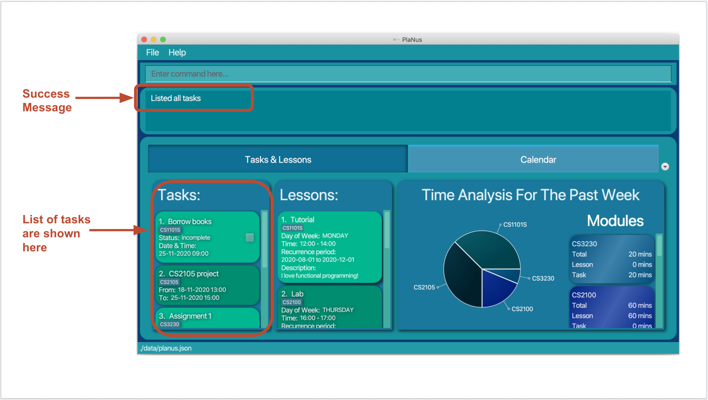

---
User Guide v1.2
---

PlaNus is a desktop app for **managing tasks, optimized for use via a Command Line Interface (CLI)** while still having
the benefits of a Graphical User Interface (GUI). If you can type fast, PlaNus can get your tasks managed faster than
traditional GUI apps.

## Quick start
* [Features](#features)
  * [Show all commands : `help`](#show-all-commands--help)
  * [List all tasks : `list`](#list-all-tasks--list)
  * [Add a task: `add`](#add-a-task-add)
  * [Delete a task : `delete`](#delete-a-task--delete)
  * [Mark a task as done: `done`](#mark-a-task-as-done-done)
  * Edit a task : `edit`
  * [Find a task : `find`](#find-a-task-by-attribute-find)
  * [Exit the program : `exit`](#exit-the-program--exit)
* [FAQ](#faq)
* [Command summary](#command-summary)

--------------------------------------------------------------------------------------------------------------------

## Features

**Notes about the command format** 

* Words in UPPER_CASE are the parameters to be supplied by the user. 
  e.g. in `add title:TITLE`, `TITLE` is a parameter which can be used as `title:homework 1`.

* Items in square brackets are optional. e.g `desc:DESCRIPTION`  
`[desc:DESCRIPTION]` can be used as `title:homework 1 desc:science project` or just as `title:homework 1`.

* Items with `...` after them can be used multiple times including zero times. 
  e.g. `done INDEX...` can be used as (i.e. 0 times), `done 1 2 3`.

* Parameters can be in any order. 
  e.g. if the command specifies `title:TITLE desc:DESCRIPTION`, `desc:DESCRIPTION title:TITLE` is also acceptable.

### Show all commands : `help`

Shows a message explaining how to access the help page.

Format: `help`

### List all tasks : `list`

Shows a list of all tasks in PlaNus.

Format: `list`

### Add a task: `add`

Adds a task of the specified type to PlaNus.

Format: `add title:TITLE type:TYPE_OF_TASK [desc:description] [date:DATE]`

* Adds the task of the specified `type:TYPE_OF_TASK` to PlaNus.
* The type must be of the following types:
    * todo
    * deadline
    * event

Examples:
* `add title:return book type:todo` Adds a task with title return book and type todo to PlaNus.
* `add title:Birthday party type:event desc:Frank’s birthday party date:2019-03-08`
  Adds a task with title “Birthday party” , type event,
  description “Frank’s birthday party” , and date “2019-03-08” to PlaNus.

### Delete a task : `delete`

Deletes the specified task from PlaNus.

Format: `delete INDEX`

* Deletes the task(s) at the specified `INDEX`.
* The index refers to the index number shown in the displayed task list.
* The index **must be a positive integer** 1, 2, 3, ...

Examples:
* `list` followed by `delete 2 3` deletes the 2nd and the 3rd tasks in the results of the `list` command.
* `find title:homework` followed by `delete 1` deletes the 1st task in the results of the `find` command.

### Mark a task as done: `done`

Marks a specified task in PlaNus as done.

Format: `done INDEX...`

* Marks the task(s) at the specified `INDEX...` as done
* The index refers to the index number shown in the displayed task list
* The index **must be a positive integer** 1, 2, 3, ...

Examples:
* `list` followed by `done 2 3` marks the 2nd and the 3rd tasks in the results of the `list` command status to be done.
* `find title:homework` followed by `done 1` marks the 1st task in the results of the `find` command status to be done.

### Find a task by attribute: `find`

Finds a task by a set of defined attribute by the user

Format: `find ATTRIBUTE_1:SEARCH_PHRASE ATTRIBUTE_2:SEARCH_PHRASE ...`

Available attributes in v1.2 include:
* `title:` find all tasks with the given title
* `desc:` find all tasks with the given description
* `type:` find all tasks with the given type
* `date:` find all tasks with the given date

Examples:
* `find title:play games` will list all tasks with title including the phrase `play games`
* `find type:todo` will list all tasks with the type `todo`
* `find title:dinner type:todo` will list all tasks with the type `todo` and title that includes `dinner`

### Exit the program : `exit`

Exits PlaNus.

Format: `exit`

--------------------------------------------------------------------------------------------------------------------

## FAQ

**Q**: How do I start the application? 
**A**: In command prompt, go to the folder the application resides in and type: java - jar planus.jar

--------------------------------------------------------------------------------------------------------------------

## Command summary

Action | Format, Examples
--------|------------------
**Add** | `add title:TITLE type:TYPE_OF_TASK [desc:DESCRIPTION] [date:DATE]`   e.g., `add title:return book type:todo`
**Delete** | `delete INDEX...`   e.g., `delete 3 5 6`
**List** | `list`
**Help** | `help`
**Done** | `done INDEX...`  e.g., `done 1 2 3`
**Exit** | `exit`

