---

User Guide v1.3
---

This user guide provides [set-up](#set-up) instructions, and a detailed description of all the [features](#features) available in the PlaNus application. You can also access this user guide on the application website with
this [link](https://ay2021s1-cs2103t-t12-3.github.io/tp/).

## Table of Contents

* [Introduction](#introduction)
* [Set-up](#set-up)
* [Features](#features)
  * [1. General Features](#1-general-features)
      * [1.1 Show all commands : `help`](#11-show-all-commands--help)
      * [1.2 Clear the program : `clear`](#12-clear-the-program--clear)
      * [1.3 Exit the program : `exit`](#13-exit-the-program--exit)
  * [2. Create, Read, Update and Delete a Task](#2-create-read-update-and-delete-a-task)
    * [2.1 List all tasks : `list-task`](#21-list-all-tasks--list-task)
    * [2.2 Add a deadline: `deadline`](#22-add-a-deadline--deadline)
    * [2.3 Add an event: `event`](#23-add-an-event--event)
    * [2.4 Mark a deadline as done: `done`](#24-mark-a-deadline-as-done--done)
    * [2.5 Edit a task : `edit-task`](#25-edit-a-task--edit-task)
    * [2.6 Find a task : `find-task`](#26-find-a-task-by-an-attribute--find-task)
    * [2.7 Delete a task : `delete-task`](#27-delete-a-task--delete-task)
  * [3. Create, Read, Update and Delete a Lesson](#3-create-read-update-and-delete-a-lesson)
    * [3.1. List all lessons: `list-lesson`](#31-list-all-lessons-list-lesson)
    * [3.2. Add a lesson: `lesson`](#32-add-a-lesson--lesson)
    * [3.3. Edit a lesson: `edit-lesson`](#33-edit-a-lesson--edit-lesson)
    * [3.4. Find a lesson: `find-lesson`](#34-find-a-lesson--find-lesson)
    * [3.5. Delete a lesson: `delete-lesson`](#35-delete-a-lesson--delete-lesson)
  * [4. Calendar View](#4-calendar-view)
  * [5. Data Analysis](#5-data-analysis)
* [Glossary](#glossary)
* [Input format summary](#input-format-summary)
* [Command summary](#command-summary)

## Introduction

PlaNus is a **task managing desktop application** for students in NUS with many projects and deadlines, optimized for use via a Command Line Interface (CLI) with the benefits of Graphical User Interface (GUI). PlaNus reduces the time spent by students in task management as adding tasks and lessons is now simple and quick!

Objectives of PlaNus:
1. Provide students with a detailed breakdown of how much time they spend on their tasks and lessons in their respective modules.
2. Allow students to have a calendar view of their schedule.

--------------------------------------------------------------------------------------------------------------------

## Set-up

1. Ensure you have Java 11 or above installed in your computer.
2. Download the latest planus.jar from **[here](https://github.com/AY2021S1-CS2103T-T12-3/tp/releases/)**.

    

3. Copy the file to the folder you want to use as the home folder for PlaNus.
4. Double-click the file to start the app. Upon launching PlaNus, you should see the following user interface.

    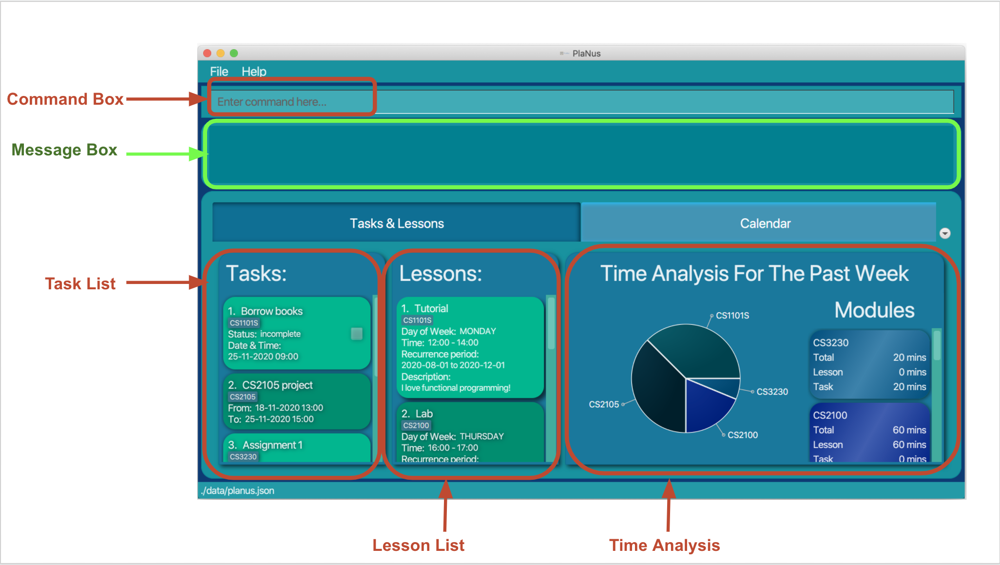

5. Alternatively, in command prompt (for Windows) or terminal (in MacOS), go to the directory where planus.jar is stored and enter `java -jar planus.jar`.To open command prompt (for Windows) or terminal (in MacOS), simply search for them in your computer.
6. You may try out some commands listed in the [command summary](#command-summary) to explore the app.

--------------------------------------------------------------------------------------------------------------------
## Features

This section is a comprehensive walkthrough of the features in PlaNus.

**:information_source: Notes about the command format** 
* Words highlighted are code snippets.  
    - e.g. `title`
* Words in **upper case** are the parameters (i.e. user input) to be supplied by the user. 
  - e.g. in `event title:TITLE`, `TITLE` is a parameter which users can determine.
  - For example, users can type `title:homework 1` or `title:assignment`.

* Items in **square brackets** are optional fields that a user can provide to add more details to the command.  
  - e.g. command `event title:Title [desc:DESCRIPTION]` means that the `desc` field is optional.
  - In the above case, users can either type `event title:homework 1` or `title:homework 1 desc:science project` if they want to store a description of the event.

* Items with `...` after them can be keyed in multiple times. 
  - e.g. `delete-task INDEX...` can be used as both `delete-task 1` or `delete-task 1 2 3`.

* Parameters can be in any order. 
  - e.g. commands `deadline title:TITLE desc:DESCRIPTION` and `deadline desc:DESCRIPTION title:TITLE` are the same.

## 1. General Features

This section shows features that deal with the general functionality of PlaNus application.

### 1.1 Show all commands : `help`

Shows the user a link to the user guide.

Format: `help`

1. Type in `help` into the command box.
2. A success message and a pop-up window with a link to the user guide will appear.

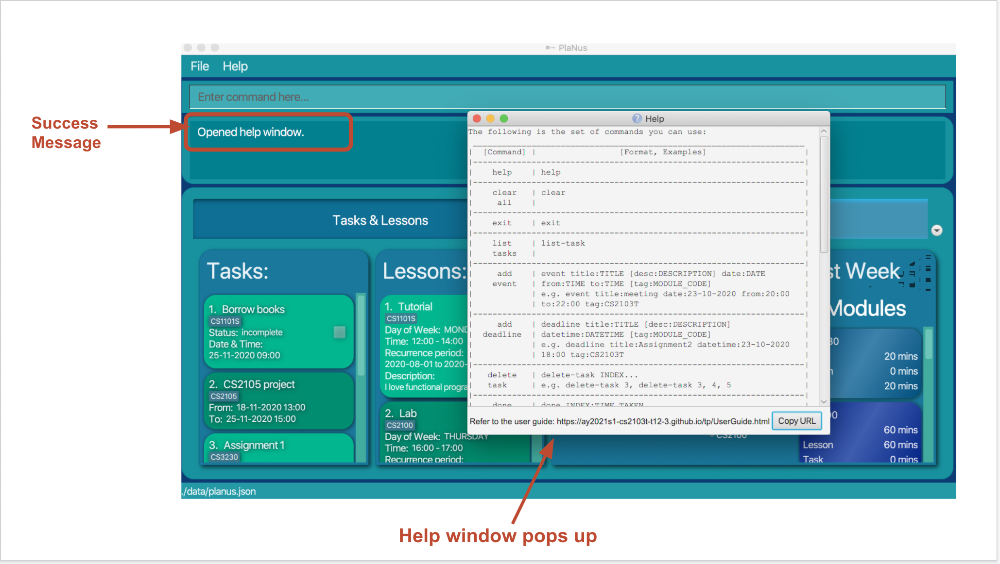

 

### 1.2 Clear the program : `clear`

Users can clear all the tasks in the PlaNus.

Format: `clear`

1. Type in `clear` into the command box.

 
2. All the tasks and lessons in PlaNus will be cleared.
 

 

### 1.3 Exit the program : `exit`

Users can exit PlaNus.

Format: `exit`

1. Type `exit` into the command box.

    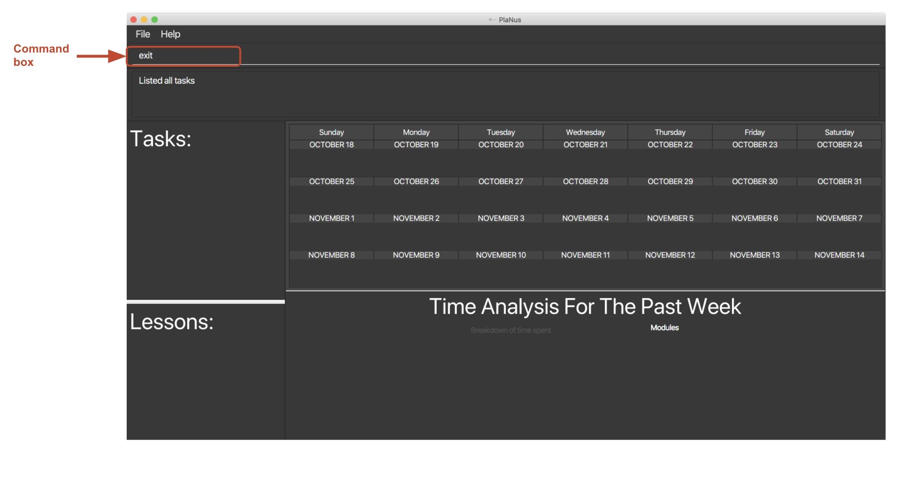

2. The application window will automatically close.

 

## 2. Create, Read, Update and Delete a Task

This section shows features that deal with operation of tasks including
creating, reading, updating and deleting a task. A task can be either a
`event` or `deadline`.  

### 2.1 List all tasks : `list-task`

Shows the user a list of all the tasks in PlaNus.

Format: `list-task`

1. Type in `list-task` into the command box.
2. A success message will appear and list of all task will be shown in the task panel.

 

### 2.2 Add a deadline : `deadline`

Users can add a deadline to PlaNus.
 

A deadline is a task that has a compulsory deadline date and time.

Format: `deadline title:TITLE [desc:DESCRIPTION] datetime:DATE_TIME [tag:MODULE_CODE]`

* Adds a deadline to PlaNus,
    * with the specified title in `title:TITLE`,
    * with the specified description in `description:DESCRIPTION`,
    * with a date and time in `datetime:DATE_TIME` of when this deadline should be completed before,
    * with a tag in `tag:MODULE_CODE` indicating the module of which this deadline belongs to.
  * the added deadline will be tracked for time analysis if it has a tag.

Examples:

To add a deadline with title "Return book", and a date and time of "02-01-2020 18:00" to PlaNus,
users can do the following:

1) Type in the command box the following command:
* `deadline title:Return book datetime:02-01-2020 18:00`

2) This adds the corresponding deadline to PlaNus. You can see the added deadline in the task list.

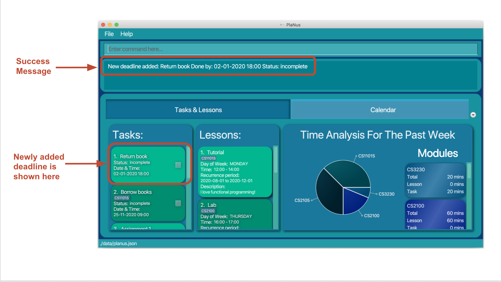

 

### 2.3 Add an event : `event`

Users can add an event.
 

An event is a task that has a start time, end time and a date.

Format: `event title:TITLE date:DATE from:START_TIME to:END_TIME [desc:DESCRIPTION] [tag:MODULE_CODE]`

* Adds an event to PlaNus,
    * with the specified title in `title:TITLE`,
    * with the specified description in `description:DESCRIPTION`,
    * on the date specified in `date:DATE`, starting from the time specified in `from:START_TIME` to the time specified in `to:END_TIME`,
    * with a tag in `tag:MODULE_CODE` indicating the module of which this deadline belongs to.
  * the added event will be tracked for time analysis if it has a tag.
  * Event must not overlap with existing events or lessons.

Examples:

To add an event with title "Project meeting", and a date "29-10-2020" with start time of "09:00" and end time of "11:30" and with tag "CS2103T" to PlaNus,
users can do the following:

1) Type in the command box the following command:
* `event title:Project meeting date:29-10-2020 from:09:00 to:12:30 tag:CS2103T`

2) This adds the corresponding event to PlaNus. You can see the added event in the task list and the calendar. The duration if the event will be recorded for time analysis.

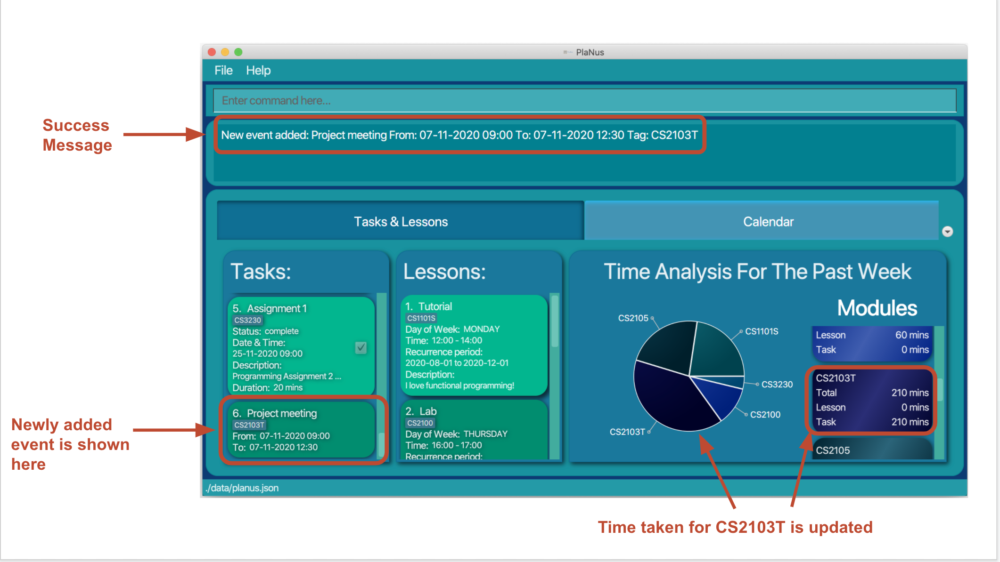

 

### 2.4 Mark a deadline as done : `done`

Users can mark a specified deadline in PlaNus as done.

Format: `done INDEX:TIME_TAKEN...`

* marks the deadline(s) at the specified `INDEX` as done and records the time taken to complete the deadline.
* the index refers to the index number shown in the displayed task list.
* the time taken refers to the time in minutes that the user took to complete the specific deadline.
* the index and time taken **must be a positive integer** 1:20, 2:30, 3:120, ...

**:information_source: Notes** 

* There are two type of tasks, event and deadline.
    * Only a deadline can be marked as done through this command, an error message will be shown if the user attempts to mark an event as done.
* After the user has marked a deadline as done, the user cannot edit the deadline or undo the done command anymore.

Examples:

* `list-task` followed by `done 2:30 3:60`
    * Marks the 2nd and the 3rd tasks in the results of the `list` command status to be done, and records that the user has spent 30 minutes to finish the 2nd task, and 60 minutes to finish the 3rd task.
* `find-task title:homework` followed by `done 1:20`
    * Marks the 1st task in the results of the `find` command status to be done and record the time taken to complete the deadline as 20 minutes.

To mark the first deadline in the current task list as done and stating you have spent 50 minutes on it,
users can do the following:
1) Type in the command box the following command:
* `done 1:50`

2) The status of the deadline has been set to complete, and the time taken to complete the task will be used for time analysis.

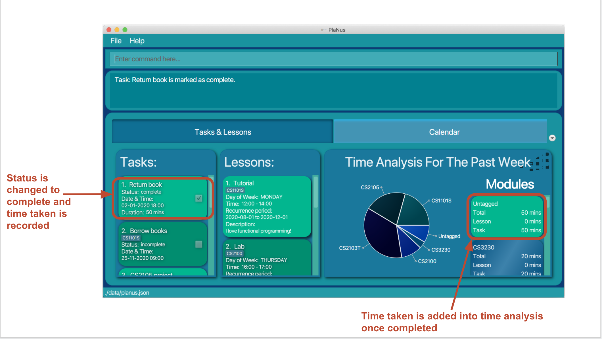

 

### 2.5 Edit a task : `edit-task`

Users can edit a task by a set of attributes given below.

Format: `edit-task INDEX ATTRIBUTE_1:NEW_VALUE ATTRIBUTE_2:NEW_VALUE ...`

* Edits the task(s) at the specified INDEX.
* The index refers to the index number shown in the displayed task list.
* The index **must be a positive integer** 1, 2, 3, …

**:information_source: Notes** 

* If different fields are provided in the command, all the provided fields of the specified task will be updated.
* If a deadline has a status of **complete**, it cannot be edited.
* Fields that the user can modify differ by the type of task(Event or Deadline) the user is trying to modify.

  * Available attributes for both deadline and event in v1.3 include:
    * `title:` edits the title of the specified task
    * `desc:` edits the description of the specified task
    * `tag:` edits the tag of the specified task
  * Available attributes for **deadline only** in v1.3 include:
      * `datetime:` edits the date and time of the specified deadline
  * Available attributes for **event only** in v1.3 include:
      * `date:` edits the date of the specified event
      * `from:` edits the start time of the specified event
      * `to:` edits the end time of the specified event

Examples:

To edit the date and time of a task, users can do the following:

1) Display all lessons by typing `list-task` in the command box, and find the index of the task you want to edit in the task list. The index is displayed in the top left corner of each task.

This displays all tasks in the task list.

2) Type `edit-task` and the index of the task, followed by the new date and time you want to update the task with.
For example, if we want to change the first task start time to be an hour earlier, we can type
`edit-task 1 from:18:00` in the command box.

This changes the start time of the first task to 18:00 which is one hour earlier than the original start time. You can view the task with the updated information in the task list.

Other examples:
* `edit-task 1 title:play games` 
    * Edits the first task in the results of the `list` command, changing its title to `play games`.
* `find-task type:deadline` followed by `edit-task 3 desc:This is very urgent!` 
    * Edits the first deadline of the third deadline in the results of the `find` command, changing its description to "This is very urgent!".
* `find-task title:homework` followed by`edit-task 2 desc:Homework is difficult date:01-01-2020` 
    * Edits the second task in the results of the `find-task` command if the task is an event, changing its date to 01-01-2020 and its description to "Homework is difficult", otherwise, PlaNus will notify the user of the incompatible error.
* `edit-task 1 tag:CS2103T` 
    * Edits the first task in the results of the `list-task` command, changing its tag to "CS2103T".

 

### 2.6 Find a task by an attribute : `find-task`

Users can find a task by a set of attributes given below.

Format: `find-task ATTRIBUTE_1:SEARCH_PHRASE ATTRIBUTE_2:SEARCH_PHRASE ...`

**:information_source: Notes** 

* If the user provides different attributes in the command, tasks that match all attributes will be displayed.

* If the user provides multiple search phrases of the same attribute in the command, tasks that match any of the search phrases will be displayed.

Available attributes in v1.3 include:
* `title:` finds all tasks which contain the search phrase in the given title
* `desc:` finds all tasks which contain the search phrase in the given description
* `date:` finds all tasks happening on or due the searched date
* `status:` finds all tasks with the given status
* `tag:` finds all tasks related with the given module tag (case-insensitive)

Examples:

To find all tasks with titles containing the phrase "CS" (case-insensitive), users can do the following:

1) List all tasks by typing `list-task` in the command box:

2) Type the following command in the command box: 
* `find-task title:CS` 

This lists all tasks with a title including the phrase `CS`.

Other examples:
* `find-task title:play games` 
    * Lists all tasks with a title including the phrase `play games`.
* `find-task tag:CS2040` 
    * Lists all tasks with a tag containing `CS2040`.
* `find-task date:01-01-2020` .
    * List all tasks happening on or due `01-01-2020`
* `find-task title:dinner title:lunch`.
    * List all tasks with the title including either `dinner` or `lunch`.

 

### 2.7 Delete a task : `delete-task`

Users can delete the specified task from PlaNus.

Format: `delete-task INDEX...`

* Deletes the task(s) at the specified `INDEX`.
* The index refers to the index number shown in the displayed task list.
* The index **must be a positive integer** 1, 2, 3, ...
* The user can provide more than 1 index at the same time, eg. `delete-task 1 2 3`.
    *  However, if one of the index is invalid, the whole command will not be executed, and an error message will be shown.

Examples:

To delete the second task, users can do the following:

1) Type `list-task` in the command box to display all tasks.

2) Type `delete-task 2` in the command box.

 
This deletes the 2nd task from PlaNus.

Other examples:
* `list-task` followed by `delete-task 1 2` 
    * Deletes the 1st task followed by the 2nd task in the results of the `list-task` command.
* `find-task title:homework` followed by `delete-task 1` 
    * Deletes the 1st task in the results of the `find-task` command.

 

## 3. Create, Read, Update and Delete a Lesson

This section shows features that a user can use to manage lessons. A lesson happens in a 
recurring manner that have a start and end time, and a start and end date.

### 3.1 List all lessons :`list-lesson`

Shows the user a list of all the lessons in PlaNus.

Format: `list-lesson`

To show all lessons currently stored in PlaNus, users can do the following:

1) Type in the command box the following command:
* `list-lesson`

This displays all lessons in the lesson list.

### 3.2 Add a lesson : `lesson`

Users can add a lesson to PlaNus.

Format: `lesson title:TITLE tag:MODULE_CODE [desc:DESCRIPTION] day:DAY from:TIME to:TIME start:DATE end:DATE`

* Adds a lesson to PlaNus, 
    * with the title specified in `title:TITLE`, 
    * starting from the date specified in `start:DATE` to the date specified in `end:DATE`, on the days specified in `day:DAY` from the time specified in `from:TIME` to the time specified in `to:TIME`.

**:information_source: Notes** 

* The format of day in `day:DAY` must be as follows (case-insensitive):
  * Monday, Tuesday, ..., Sunday

Examples:

To add a lesson named "Week 9 Tutorial" which is under module "CS2101", and happens on Monday from 12pm to 14pm, 
from 10 Aug 2020 to 10 Nov 2020, users can do the following:

1) Type in the command box the following command:
* `lesson title:Week 9 Tutorial tag:CS2101 desc:Most exciting lecture in NUS! day:Mon from:12:00 to:14:00 start:10-08-2020 end:10-11-2020`

2) This adds the corresponding lesson to PlaNus. You can see the added lesson in the lesson list, calendar view and 
time analysis.

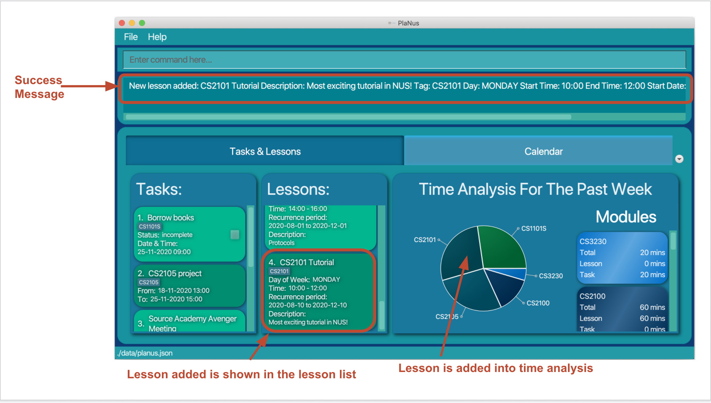

 

### 3.3 Edit a lesson : `edit-lesson`

Users can edit a lesson in PlaNus. When a lesson is edited, all the occurrences of the particular lesson will be updated.

Format: `edit-lesson INDEX [title:TITLE] [tag:MODULE_CODE] [desc:DESCRIPTION] [day:DAY] [from:TIME] [to:TIME] [start:DATE] [end:DATE]`

**:information_source: Notes** 

* `INDEX` refers to the index of the lesson in the lesson list.

* The format of day in `day:DAY` must be as follows (case-insensitive):
  * Monday, Tuesday, ..., Sunday

* Edit a lesson in PlaNus
    * The values of the specified lesson will be changed to the new values specified in the `edit-lesson` command.

Examples:

To edit a lesson, users can do the following:

1) Display all lessons by typing `list-lesson` in the command box.

This will display all lessons.
 
2) Choose the lesson you want to edit. Find its index which is displayed on the top-left corner.
For example, if we want to change the first lesson to Wednesday, we can type
`edit-lesson 1 day:WED` in the command box.

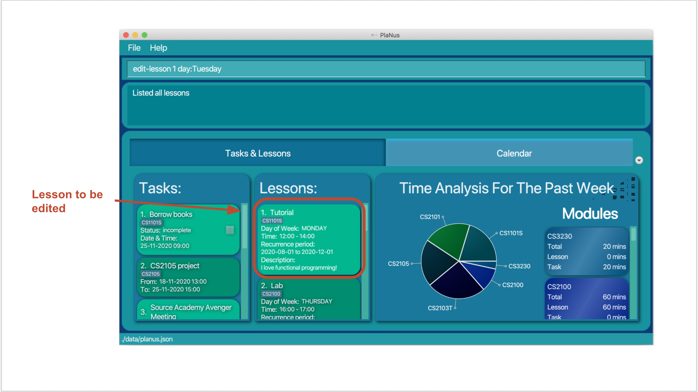

This changes the day of the first lesson to every Wednesday. You can see the calendar view and 
time analysis also updated.

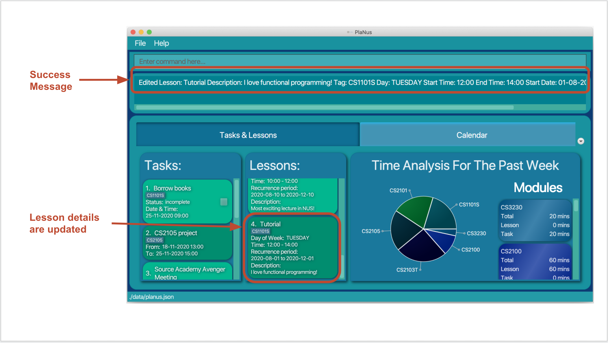

### 3.4 Find a lesson : `find-lesson`

Users can find a lesson by a set of attributes given below.

Format: `find-lesson ATTRIBUTE_1:SEARCH_PHRASE ATTRIBUTE_2:SEARCH_PHRASE ...`

**:information_source: Notes** 

* If the user provides different attributes in the command, lesson that match all attributes will be displayed.

* If the user provides multiple search phrases of the same attribute in the command, lessons that match any of the search phrases will be displayed.

Available attributes in v1.3 include:
* `title:` finds all lessons which contain the search phrase in the given title
* `desc:` finds all lessons which contain the search phrase in the given description
* `date:` finds all lessons happening on the searched date
* `time:` finds all lessons happening at the searched time
* `datetime:` finds all lessons happening at the searched date and time
* `tag:` finds all lessons related to the given module tag (case-insensitive)

Examples:

To find all lessons with titles containing the phrase "tutorial" (case-insensitive), users can do
the following steps:

1) List all lessons by typing `list-lesson` in the command box:

2) type the following command in the command box: 
* `find-lesson title:tutorial` 

This lists all lessons with a title including the phrase `Tutorial`.

Other examples include:
* `find-lesson tag:CS2040` 
    * Lists all lessons with a tag containing 'CS2040'.
* `find-lesson date:01-01-2020` .
    * List all lessons happening on 01-01-2020.
* `find-lesson title:dinner title:lunch`.
    * List all lessons with the title including either `dinner` or `lunch`.
* `find-lesson datetime:01-01-2020 14:00` 
    * Lists all lessons happening on 01-01-2020 at 14:00.

 

### 3.5 Delete a Lesson : `delete-lesson`

Users can delete a specified set of lessons from PlaNus.

Format: `delete-lesson INDEX...`

**:information_source: Notes** 

* `INDEX` refers to the index of the lesson in the lesson list.

* `...` means that there can be multiple indexes supplied. If all indexes are valid,
all lessons of the specified indexes will be deleted. 

Examples:

To delete the first two lessons, users can following the steps:

1) Type `list-lesson` in the command box to display all lessons.

2) Type `delete-lesson 1 2` in the command box.

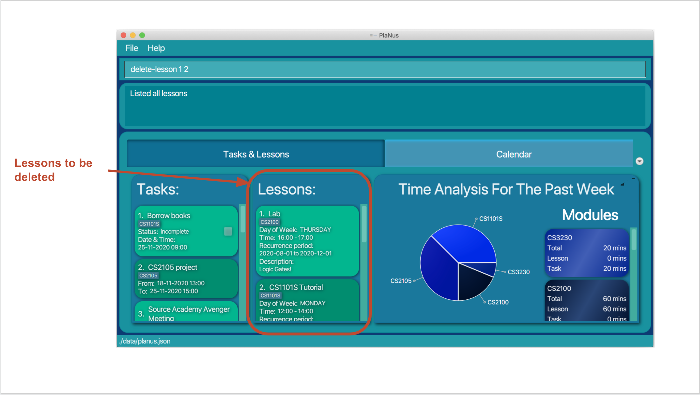
 
This deletes the 1st and 2nd lesson from PlaNus.

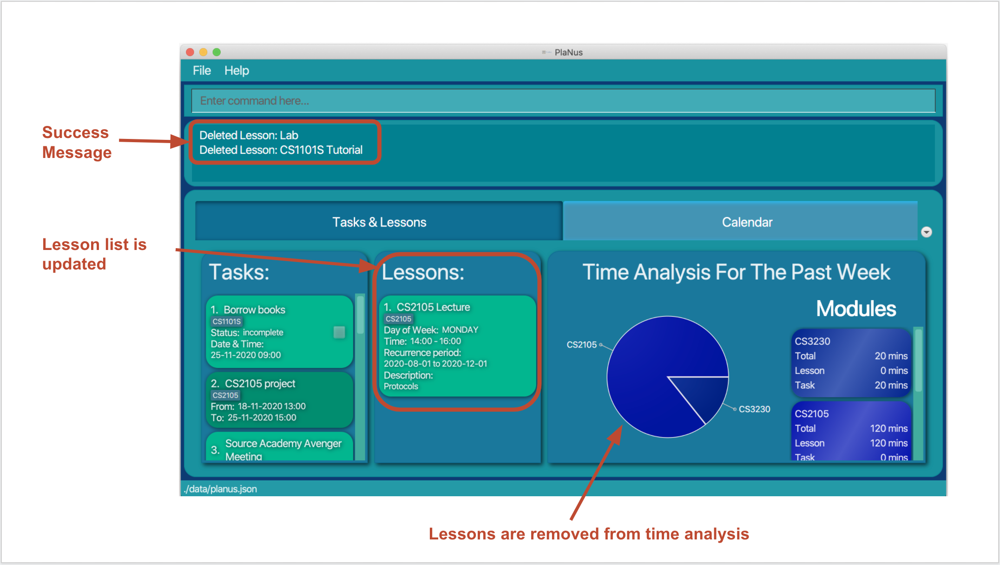

Users can also delete lessons by first finding the lessons of interest, refer to [feature 3.4](#34-find-a-lesson--find-lesson)
for more information. Sample usage:
* `find-lesson title:Lab` followed by `delete-lesson 1` 
    * Deletes the 1st lesson in the results of the `find-lesson` command.

## 4. Calendar View

The calendar view is located in the area shown below.

Users can use the calendar view to see what tasks and lessons they have in the previous week, current week and next 
two weeks as shown below.

Calendar view displays:
* Deadlines
* Events
* Lessons

 

## 5. Data Analysis

Users can use the pie chart and list of modules to visualise how much time is spent on each module. Each module is 
denoted by the `tag` on its task/lesson.

How does it work:
* Each module has a **time spent on tasks** and **time spent on lessons**.
* When a `deadline` is marked as done, it contributes towards **time spent on tasks** for that module. 
* When an `event` has occurred, it contributes towards **time spent on tasks** for that module.
* When a `lesson` has occurred, it contributes towards **time spent on a lesson** for that module.

Example:

* The first lesson in the list:
    * Title of "CS2103T Lecture"
    * Only occurred one time during the past week
    * Has a duration of 4 hours from 12:00 to 16:00

Therefore, the **time analysis for the week** will show that the **time spent on lessons** with the CS2103T `tag` as
240 minutes (4 hours).

**:information_source: Notes** 

* Version 1.3:
    * Only time spent on each module in the **past week** is displayed.

* In the next iteration:
    * A breakdown of time spent on each module in the **past week** and of **all time** is displayed.

 

--------------------------------------------------------------------------------------------------------------------

## Glossary
* Task: An event or a deadline
* Event: Consists of a start and end time, and a date
* Deadline: Consists of a deadline date and time
* Lesson: Consists of recurring events

--------------------------------------------------------------------------------------------------------------------

## Command summary

| Action     | Format, Examples                                             |
| ---------- | ------------------------------------------------------------ |
| **Help**   | `help`                                                       |
| **Clear all**   | `clear`                                                       |
| **Exit**   | `exit`                                                       |
| **List task**   | `list-task` |
| **Add Event**  | `event title:TITLE [desc:DESCRIPTION] date:DATE from:TIME to:TIME tag:MODULE_CODE`   e.g. `event title:CS2103T Group meeting date:23-10-2020 from:20:00 to:22:00 tag:CS2103T` |
| **Add Deadline**  | `deadline title:TITLE [desc:DESCRIPTION] [datetime:DATETIME] tag:MODULE_CODE`   e.g. `deadline title:Assignment2 submission datetime:23-10-2020 18:00 tag:CS2103T` |
| **Delete task** | `delete-task INDEX...`   e.g. `delete-task 3`, `delete-task 3, 4, 5`                       |
| **Done task**   | `done INDEX:TIME_TAKEN...`  e.g. `done 1:20`, `done 1:20 2:60 3:120`    |
| **Find task**   | `find-task ATTRIBUTE_1:SEARCH_PHRASE ATTRIBUTE_2:SEARCH_PHRASE ...`   e.g.`find-task title:dinner date:02-02-2020` |
| **Edit task**   | `edit-task INDEX [title:TITLE] [date:DATE] [desc:DESCRIPTION] [tag:MODULE_CODE] [datetime:DEADLINE (deadline only)] [date:EVENT_DATE (event only)] [start:START_TIME (event only)] [end:END_TIME (event only)]` e.g. `edit-task 1 date:02-02-2020 12:00 tag:CS2101` |
| **List lesson** | `list-lesson` |
| **Add Lesson** | `lesson title:TITLE tag:MODULE_CODE [desc:DESCRIPTION] day:DAY from:TIME to:TIME start:DATE end:DATE` e.g.`lesson title:CS2103T Lecture tag:CS2103T desc:Most exciting lecture in NUS! day:Mon from:12:00 to:14:00 start:01-01-2020 end:01-05-2020` |
| **Edit lesson**   | `edit-lesson INDEX [title:TITLE] [tag:MODULE_CODE] [desc:DESCRIPTION] [day:DAY] [from:TIME] [to:TIME] [start:DATE] [end:DATE]`   `e.g.edit-lesson 1 start:10-10-2020`                                                       |
| **Find lesson**   | `find-lesson ATTRIBUTE_1:SEARCH_PHRASE ATTRIBUTE_2:SEARCH_PHRASE ...`   e.g. `find-lesson title:Tutorial` |
| **Delete lesson**   | `delete-lesson INDEX...`   e.g. `delete-lesson 1 2 3` |

## Input format summary
All the keywords mentioned in the command should follow the format stated below:

| keyword     | Format, Examples                                             |
| ---------- | ------------------------------------------------------------ |
| **date**   | `dd-MM-yyyy`    e.g. 23-10-2020                                                    |
| **time**   | `HH:mm`    e.g. 10:00                                                   |
| **datetime** | `dd-MM-yyyy HH:mm`   e.g. 21-10-2020 10:00 
| **day**  |  `Monday/Tuesday/Wednesday/Thursday/Friday/Saturday/Sunday` |
| **from, to, time** | `HH:mm`   e.g. 18:00      |
